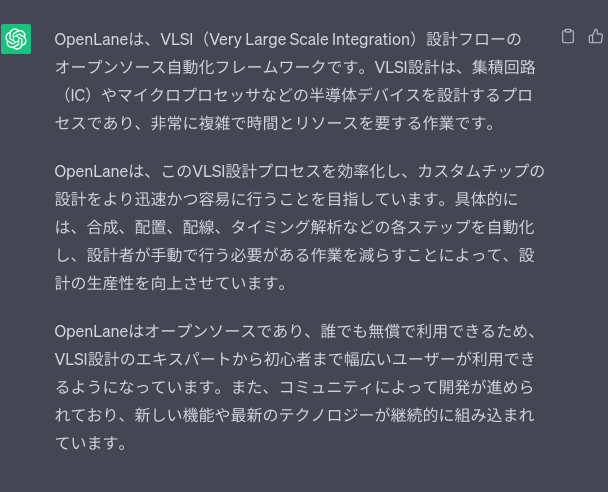

# OpenLane を誰でも簡単に!
このレポジトリは OpenLane の簡単なサンプルを誰でも簡単に
最後まで実行可能なようにする情報の蓄積を目的にしています。

現時点(2023年7月25日)では情報だけですが、将来的に独自のサンプルも提供します。

# Quick Start. とにかく実行したい!!
本情報は[ここ](https://note.com/akira_tsuchiya/n/nf770aa77b785)
の IIC-OSIC-TOOLS の情報をもとにしています。手順は先のページのほうが
絵付きで詳しく書いてあります。

0. ターゲットは Linux/Mac/[Windows(WSL)](/windows.md)
1. Docker の準備
2. iic-osic-tools の 2022.12 を clone
```
$ git clone https://github.com/iic-jku/iic-osic-tools -b 2022.12 iic-osic-tools-2022.12
```
3. インストールおよび実行
```
$ cd iic-osic-tools-2022.12
$ sudo DOCKER_TAG=2022.12 ./start_shell.sh
```
これで Docker のシェルが立ち上がります。GUI が必要なら sudo ./start_x.sh を実行。
4. caravel_user_project の mpw-9a を clone
```
/foss/designs > git clone https://github.com/efabless/caravel_user_project.git -b mpw-9a
```
5. フローを実行
```
/foss/designs > export PDK=sky130B
/foss/designs > cd caravel_user_project
/foss/designs/caravel_user_project > cd openlane
/foss/designs/caravel_user_project/openlane > flow.tcl -design user_proj_example -tag my-test -overwrite
```
これで klayout で表示可能な GDS-II 形式のレイアウトが出来るはず。

質問等は [ISHI 会](https://ishi-kai.org/) の discord へ。

## IIC-OSIC-TOOLS の 2023.06 動かん
- caravel_user_project をコンパイルできない。最初の verilator の lint チェックで
エラーになる。
- /foss/examples/SKY130_SAR-ADC1 をコンパイルできない。STEP 45 までいってエラー。LVS で落ちちゃう。

# OpenLane って何？


[OpenROAD 版の OpenLane](https://github.com/The-OpenROAD-Project/OpenLane) が
本家のようだ。なぜか [efabless 版の OpenLane](https://github.com/efabless/OpenLane) がある(更新は止まっている)。

## OpenROAD
OpenROAD という[団体名](https://theopenroadproject.org/)でもあり、
そこが提供する[ツール群](https://github.com/The-OpenROAD-Project/OpenROAD)でもある。OpenROAD のツール群の中には OpenLane も含まれる。

## OpenLane2 !!
ツールの寄せ集めじゃなくて、Nix ベースで、モジュールの形で
提供する次期バージョンのようだね。

https://github.com/efabless/openlane2

# その他ツールなど
## [caravel_user_project](https://github.com/efabless/caravel_user_project) って何？
efabless が提供する [Caravel](https://caravel-harness.readthedocs.io/en/latest/index.html) という RISC-V を含むデバッグシステムと
つなぐことが出来る OpenLane 用のプロジェクトの雛形。
どうやら Caravel の RISC-V は PicoRV32 で、I/F として
user_proj_wrapper という口が
(昔のXilinx 風に言うなら)パーシャルとして用意されている。

[Caravel 自身](https://github.com/efabless/caravel) は github で
提供されているものの RISC-V の部分は Verilog-HDL として見当たらなかった。
[caravel_pico](https://github.com/efabless/caravel_pico) なるものが
あるので、更に入れ子になっているのかも(未確認)。

### なんかおかしい
caravel_user_project の verilog/rtl/user_proj_example.v 。
verilator の lint でエラーになります。その上ビット幅にどうやら間違いがあるらしく、その後のビット幅チェックでも引っかかります。とりあえず修正してみました。
修正版は[こちら](https://github.com/ryos36/caravel_user_project)。
ただし、この修正をしても IIC-OSIC-TOOLS の 2023.06 (OpenLane 的には 2023.05) では動きませんでした。

結局、OpenLane のバージョンに合わせた caravel_user_project が必要で
どの組み合わせで動くのかは自分で試すしかない!!
(のでこのドキュメントがあるわけです）。

## [caravel_user_project_analog](https://github.com/efabless/caravel_user_project_analog)
アナログ版の雛形かな？だれか試して!!

## [iic-osic-tools](https://github.com/iic-jku/iic-osic-tools) とは？
Institute for Integrated Circuits (IIC) at the Johannes Kepler University Linz (JKU) が提供する OpenLane を含む色々ツール群をインストールした Docker コンテナ。
もとは efabless の [foss-asic-tools](https://github.com/efabless/foss-asic-tools) の fork。fork もとが tools の名称をつかっていたため、そのような名称になった模様。

## [foss-asic-tools](https://github.com/efabless/foss-asic-tools)
efabless が提供していた(過去形!!) OpenLane を含むいろいろツール群をインストールした Docker コンテナ。すでに更新は止まっている模様。

## efabless が提供する Docker コンテナ
https://hub.docker.com/u/efabless

efabless は [efabless/openlane](https://hub.docker.com/r/efabless/openlane) と
[efabless/openlane-tools](https://hub.docker.com/r/efabless/openlane-tools)
を現在 Docker コンテナとしてメンテナンスしている模様。
前者は OpenLane オンリー。後者は色々ツール入り。
おそらく OpenLane のレポジトリの Dockerfile が元ソース(未確認)。

# 情報源
- [IIC-OSICによるオープンソース設計環境のセットアップ](https://note.com/akira_tsuchiya/n/nf770aa77b785)
- [OpenMPW入門](https://vlsi.jp/OpenMPW.html)
