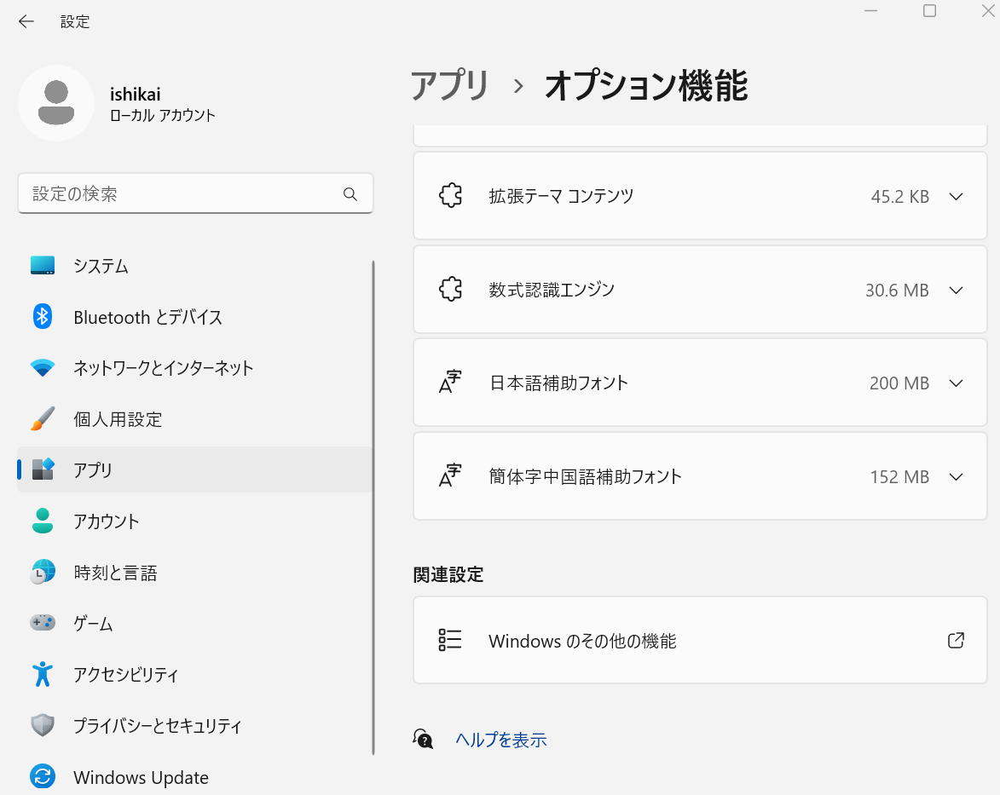
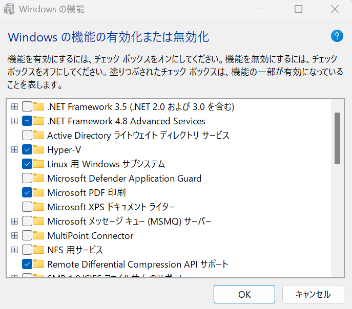
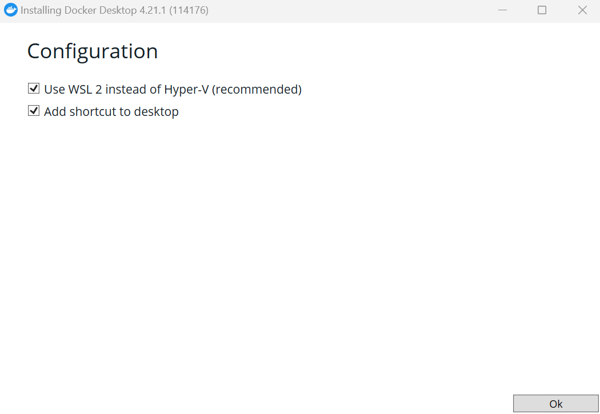
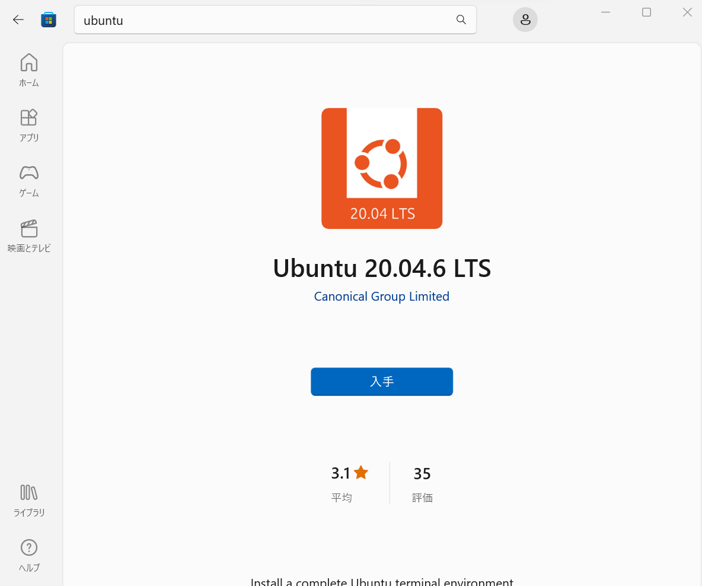
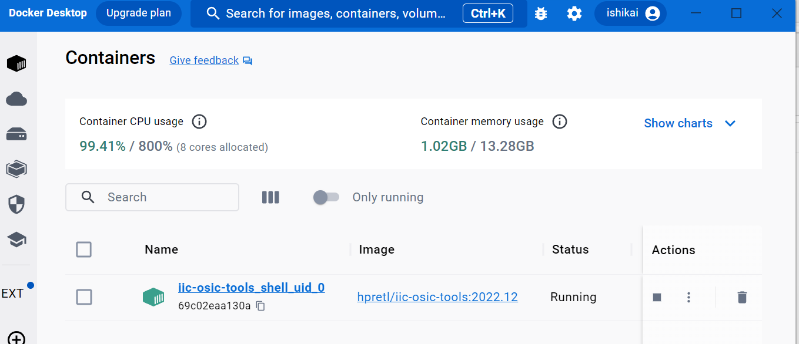

# Windows11上のWSL2に[OpenLane を誰でも簡単に!](README.md)のベースとなる環境を作る
WSL2(Windows Subsystem on Linux 2)の上にUbuntuをセットアップして、動作させます。

## WSL2の有効化
WSL2オプションを有効にする。



## Dockerのインストール
[Docker](https://hub.docker.com/)をインストールする。オプションは下記の図の通りである。


## Ubuntuのインストール
UbuntuのLTSをMicrosoft Storeインストールする。


※今回は22.04.06をインストールする。

### ソフトウェアのセットアップ
Ubuntuに必要なソフトウェアをセットアップする。
```
> sudo apt update
> sudo apt upgarde
> sudo apt git build-essential
```

## サンプルのビルド
あとは、[OpenLane を誰でも簡単に!](README.md) に従えば、サンプルがビルドできるはずである。

また、Dockerのイメージとしては、下記のように追加される。

